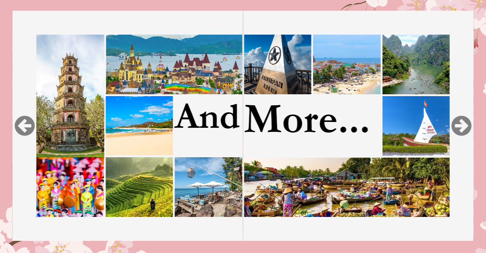

# **ALBUM ABOUT MY FUTURE FAMILY TRIPS**

## **Introduction**

This is a project which I compete in SHECODES FUTURE TECH CHALLENGE 2022. The topic of the competition is an album 
preserving our photos, thoughts, and memories of a memorable journey or planning my future dream trips with my family. Since I didn't have many family travel so I decided to make a plan for my future family trips. 

## **Build with**

I built this project with Reactjs. In the beginning, I decided to code with HTML, CSS, and JavaScript because, at that time, I had little knowledge about Reactjs. But in the end, I decided to use Reactjs. That was an interesting experience when I had to learn and code simultaneously in a short period of time, at least for me.

I didn't use any CSS Frameworks, I did it all by myself. At first, it took me too much time to style with CSS. However, later, I got used to and understand more about how CSS worked.
I knew there had been another way to make CSS more professional, faster and clearer with SASS/SCSS but I didn't have enough time to learn about SASS/SCSS so my CSS files were quite long.

Through this project, I have learned a lot of things. How to use state, ref in React, how to deploy a Reactjs website on Github,... And for CSS, I think that somehow CSS became more clear to me. I understand how flexbox works, how display works,...

## **Design**

Project link: https://truc-nt.github.io/SHECODES-FUTURE-TECH-CHALLENGE-2022/

* ### *For desktop, laptop and tablet* ##

The project is designed liked a photobook in real life. We can open the album and read its contents like you are reading a book.

* ### *For phone* ###

Each page of the album is displayed like an image slideshow. Press next and you can go to the next page like a carousel.

* ### *The content* ###

Each page has its own style, meanings. I had put all my story and feeling about this topic through this project.

Due to lack of writing skill in English, I wrote my thought in my mother tongue - VietNamese. I want to express the story of myself in the most complete and meaningful way.

## **Acknowledgments**

* A special thanks to Coding Star. His youtube video helped me how to code a flipped book. You can check his work here https://youtu.be/0kD6ff2J3BQ 

* The images used in this project are from https://www.freepik.com/, https://www.hotels.com/go/vietnam,... I had given image credits at the end of the website, you can check them there.

* Thanks to https://www.photobookvietnam.com/. I had referred how people arrange the photos in the album so that it makes the photobook more beautiful

## **Achievement**

As a result, I was honored to gain 1st prize in Shecodes Future Tech Challenge.

## **Contact**

Email: truc.ntw@gmail.com

